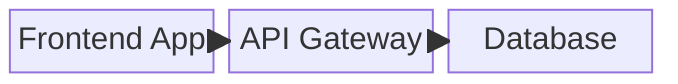
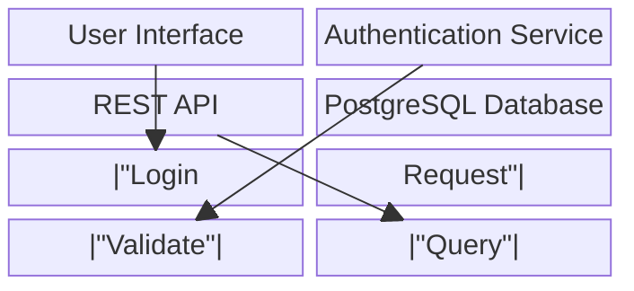

# Mermaid Block-Beta Architect

**Visually create and edit block-style architecture diagrams and export them as Mermaid block-beta syntax.**

Mermaid Block-Beta Architect is a web-based tool that bridges the gap between visual diagramming and text-based Mermaid diagrams. Design your system architecture by drawing and arranging blocks on a canvas, and instantly get Mermaid block-beta syntax that you can use in documentation, GitHub, or any Mermaid-compatible system.

Key Features
------------

*   **Visual Editor:** Draw, resize, and arrange boxes directly on a grid-based canvas. No more writing Mermaid syntax from scratch.
    
*   **Real-time Export:** See your Mermaid block-beta syntax update in real-time as you design.
    
*   **Intuitive Editing:**
    
    *   **Drag & Drop:** Easily re-arrange blocks to refine your architecture.
        
    *   **Text Editing:** Double-click blocks to edit labels and titles.
        
    *   **Connection Management:** Create and edit connections between blocks.
        
*   **Mermaid Block-Beta Output:** Export diagrams using the latest Mermaid block-beta syntax, perfect for GitHub documentation, wikis, and Mermaid-JS renderers.
    
*   **Import Support:** Paste existing Mermaid block-beta syntax to load and edit existing diagrams.
    
*   **Live Preview:** See your diagram and the corresponding Mermaid syntax update in real-time.
    

How It Works
------------

1.  **Draw Blocks:** Click and drag on the canvas to create architecture blocks.
    
2.  **Add Labels:** Double-click a block to add a descriptive label.
    
3.  **Create Connections:** Use the connection tool to link blocks with labeled relationships.
    
4.  **Arrange Layout:** Drag blocks around the canvas to create your desired architecture flow.
    
5.  **Export:** Copy the generated Mermaid block-beta syntax from the output panel.
    
6.  **Use Anywhere:** Paste the syntax into GitHub README files, Mermaid Live Editor, documentation systems, or any Mermaid-compatible environment.
    

Example Output
--------------

A simple three-block diagram created in the editor exports as clean Mermaid block-beta syntax:

For more complex diagrams with labeled connections:

Why Use Mermaid for Diagrams?
------------------------------

*   **Universal Compatibility:** Mermaid is supported natively on GitHub, GitLab, and many documentation platforms.
    
*   **Version Control Friendly:** Track changes to your architecture over time using Git, just like you do with your code.
    
*   **Documentation in Place:** Embed diagrams directly within your existing Markdown documentation.
    
*   **Lightweight & Portable:** Mermaid syntax is just text, making it fast, efficient, and universally compatible.
    
*   **Accessible:** Anyone can view the diagram source and rendered output.
    
*   **Interactive:** Many Mermaid renderers support interactive features like clickable elements.

About Block-Beta Syntax
------------------------

The Mermaid block-beta syntax is a powerful diagramming format that allows you to create:

*   Block diagrams with custom labels
*   Directional connections with optional labels
*   Structured layouts using columns
*   Clean, readable syntax that renders beautifully

Learn more about Mermaid block-beta syntax at: https://docs.mermaidchart.com/mermaid-oss/syntax/block.html

Contributing
------------

This is an open-source project and we welcome contributions! Please feel free to open an issue to report bugs, suggest features, or submit a pull request.

Made with ❤️ for developers and architects.